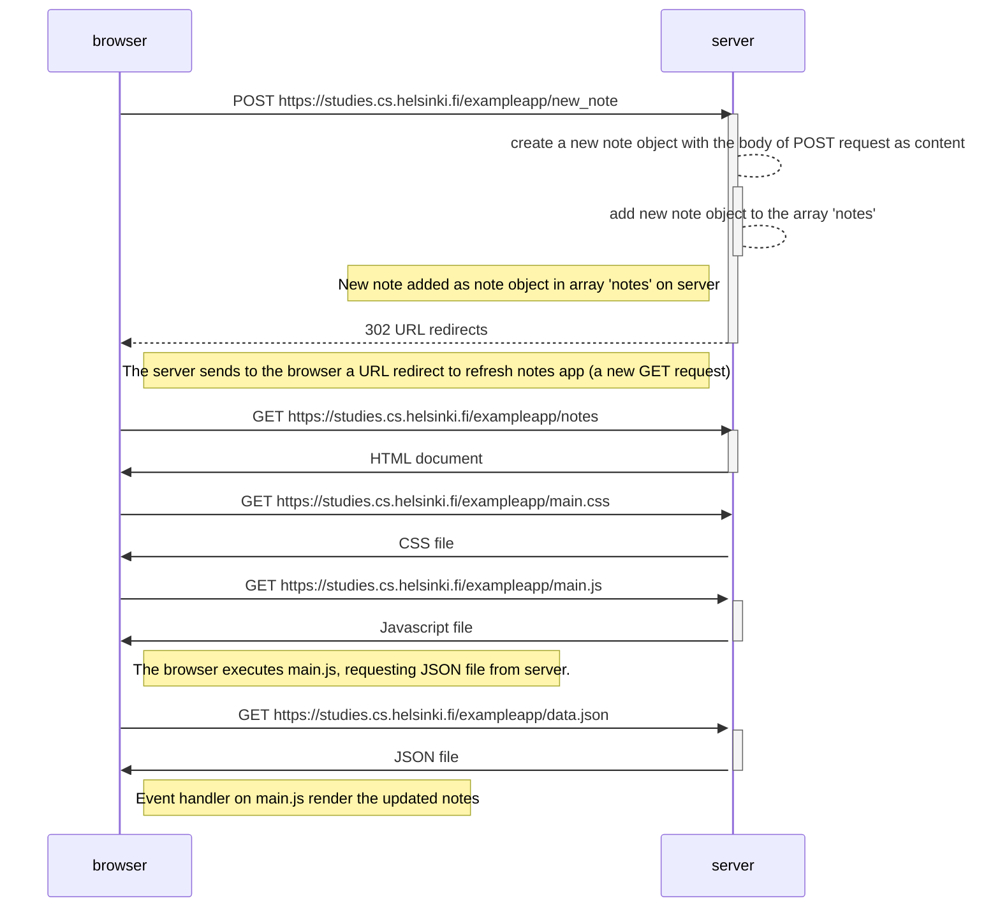

Create a new note:

```mermaid

sequenceDiagram
    participant browser
    participant server

    browser->>server: POST https://studies.cs.helsinki.fi/exampleapp/new_note
    activate server
    
    server-->server: create a new note object with the body of POST request as content
    activate server
    server-->server: add new note object to the array 'notes'
    deactivate server
   
    Note left of server: New note added as note object in array 'notes' on server
    server-->>browser: 302 URL redirects
    deactivate server

    Note right of browser: The server sends to the browser a URL redirect to refresh notes app (a new GET request)

    browser->>server: GET https://studies.cs.helsinki.fi/exampleapp/notes
    activate server
    server->>browser: HTML document
    deactivate server

    browser->>server: GET https://studies.cs.helsinki.fi/exampleapp/main.css
    activate server
    server->>browser: CSS file

    browser->>server: GET https://studies.cs.helsinki.fi/exampleapp/main.js
    activate server
    server->>browser: Javascript file
    deactivate server

    Note right of browser: The browser executes main.js, requesting JSON file from server.

    browser->>server: GET https://studies.cs.helsinki.fi/exampleapp/data.json
    activate server
    server->>browser: JSON file
    deactivate server

    Note right of browser: Event handler on main.js render the updated notes

    

```