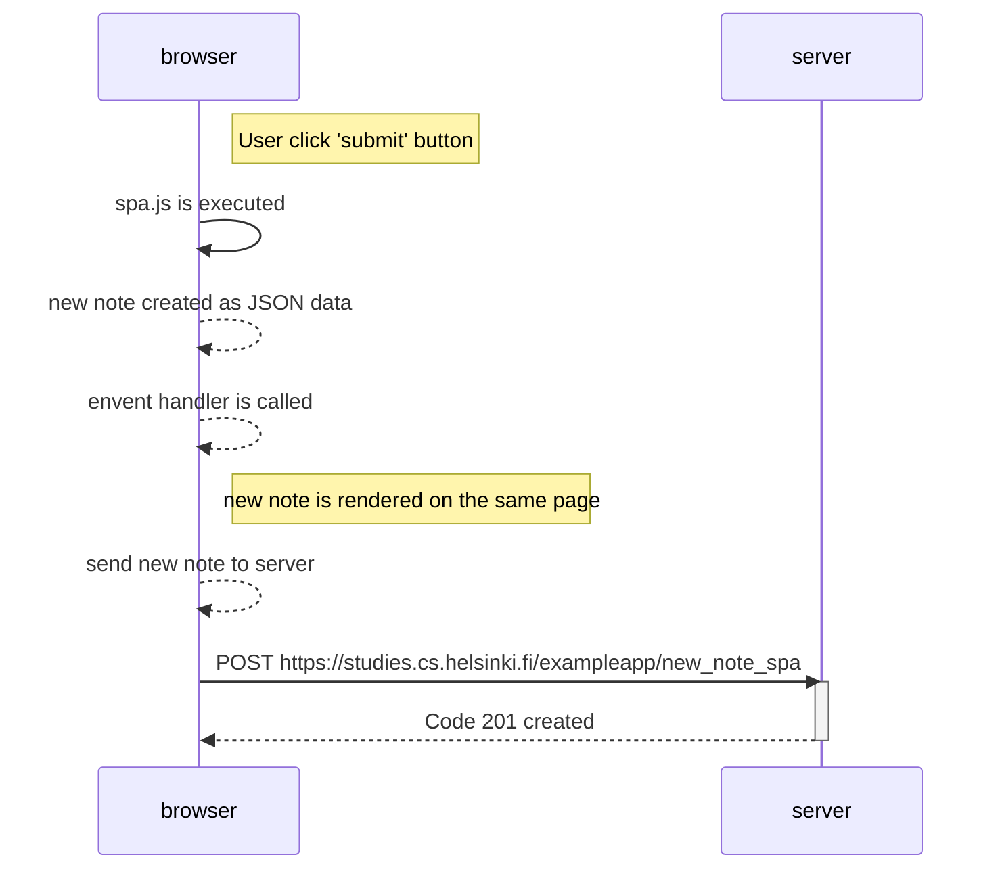

Create new note on sigle page app

```mermaid

    sequenceDiagram
    participant browser
    participant server

    Note right of browser: User click 'submit' button

    browser->>browser: spa.js is executed
    
    
    browser-->>browser: new note created as JSON data
    browser-->>browser: envent handler is called
    Note right of browser: new note is rendered on the same page

    browser-->>browser: send new note to server
    
    browser->>server: POST https://studies.cs.helsinki.fi/exampleapp/new_note_spa
    activate server
    server-->>browser: Code 201 created
    deactivate server

```
